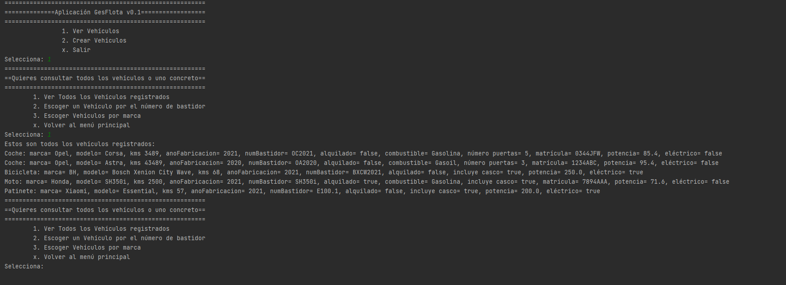

# **GesFlota**
## La aplicación definitiva para gestionar la flota de tu empresa.

### Estás buscando una aplicación para gestionar la flota de vehículos de tu empresa. BIEN, estás en el sitio adecuado, has encontrodo la solución definitiva a tus problemas, con GesFlota podrás olvidarde de los problemas a la hora de gestionar y consultar los vehículos de tu empresa de una manera ágil, fácil y sencilla. 
## Esta aplicación es la solución definitiva a tus problemas.




# NUESTRA APLICACIÓN
[Desde aquí podrá descargar la primera version de la aplicación.](https://github.com/albertrodtab/GesFlota)

[comment]: <> (```)
[comment]: <> (/*```markdown)
[comment]: <> (Syntax highlighted code block)
[comment]: <> (# Header 1 adfasdga)
[comment]: <> (## Header 2)
[comment]: <> (### Header 3)
[comment]: <> (- Bulleted)
[comment]: <> (- List)
[comment]: <> (1. Numbered)
[comment]: <> (2. List)
[comment]: <> (**Bold** and _Italic_ and `Code` text)
[comment]: <> ([Link]&#40;url&#41; and ![Image]&#40;src&#41;)
[comment]: <> (```)
[comment]: <> (For more details see [GitHub Flavored Markdown]&#40;https://guides.github.com/features/mastering-markdown/&#41;.)
[comment]: <> (### Jekyll Themes)
[comment]: <> (Your Pages site will use the layout and styles from the Jekyll theme you have selected in your [repository settings]&#40;https://github.com/albertrodtab/GesFlota/settings/pages&#41;. The name of this theme is saved in the Jekyll `_config.yml` configuration file.)
### Soporte y Contacto
[Alberto Rodríguez Taboada](https://github.com/albertrodtab)

[comment]: <> (Having trouble with Pages? Check out our [documentation]&#40;https://docs.github.com/categories/github-pages-basics/&#41; or [contact support]&#40;https://support.github.com/contact&#41; and we’ll help you sort it out.)

